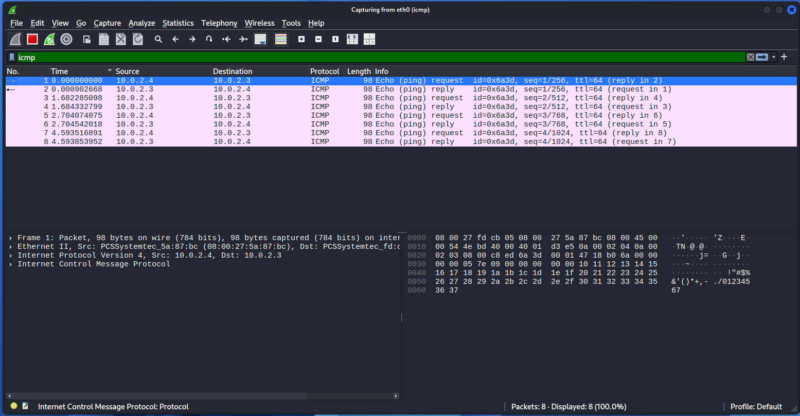
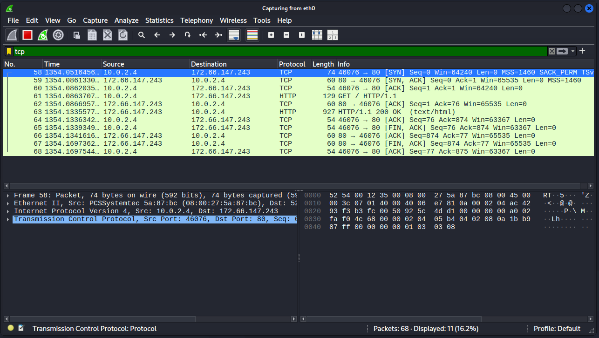
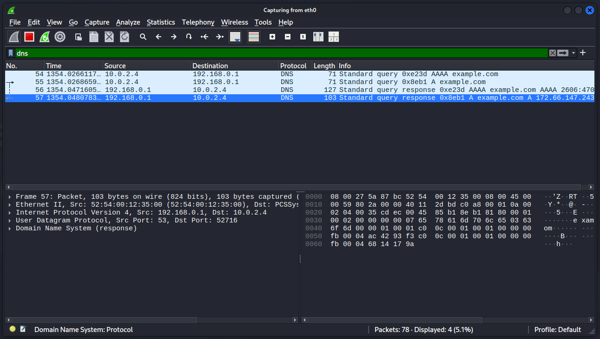

# Networking Lab Notebook

Learning network fundamentals by analysing and studying real network traffic from my small home lab.

## Lab Setup

* **Hypervisor:** VirtualBox
* **Virtual Machines:**

  * Ubuntu Server (`10.0.2.3`)
  * Kali Linux (`10.0.2.4`)
* **Network Configuration:** VirtualBox NAT Network (`10.0.2.0/24`)

## Topics Covered

* Core Basics
* OSI and TCP/IP
* CIDR and Subnetting
* Key Mechanisms
* VPN

## Subnetting Notes

`(slash number) / 8` = how many group numbers are "network"

**Example:**

* `10.5.20.7/8` (8 / 8 = 1, so 1 group number is "network")
* **Network number:** `10.0.0.0`
* **Broadcast number:** `10.255.255.255`

## Packet Capture Walkthroughs

### 1\. ICMP Request / Reply

Testing connectivity between the VMs using `ping -c 4 10.0.2.3`:

* `10.0.2.4 -> 10.0.2.3`: Echo (ping) request
* `10.0.2.3 -> 10.0.2.4`: Echo (ping) reply
* Sent 4 times because of `-c 4`.

### 2\. TCP Handshake \& HTTP Traffic

Connecting to `example.com` (`172.66.147.243`) on port 80:

* **58 \[SYN]:** Kali initiates the connection to the web server.
* **59 \[SYN, ACK]:** The server acknowledges and agrees to connect.
* **60 \[ACK]:** Kali confirms the connection, completing the 3-way handshake.
* **61 \[GET / HTTP/1.1]:** Kali requests the webpage.
* **62 \[ACK]:** Server confirms the request was received.
* **63 \[HTTP/1.1 200 OK]:** Server delivers the actual webpage data (`text/html`).
* **64 \[ACK]:** Kali confirms receipt of the webpage.

### 3\. DNS Query / Response

Resolving the domain name `example.com`:

* **54:** Standard query asking for the `AAAA` record (IPv6).
* **55:** Standard query asking for the `A` record (IPv4).
* **56:** Response answering the `AAAA` query with an IPv6 address.
* **57:** Response answering the `A` query with the IPv4 address (`172.66.147.243`).

## Key Takeaways

It was interesting for me to understand how networking works. Especially, I was amazed by subnetting and how easily we can understand what is network and what is broadcast. I also liked seeing how the TCP handshake works in practice so we can understand how clients and servers talk to each other.

## Tools Used

* VirtualBox
* Kali Linux
* Ubuntu Server
* Wireshark

