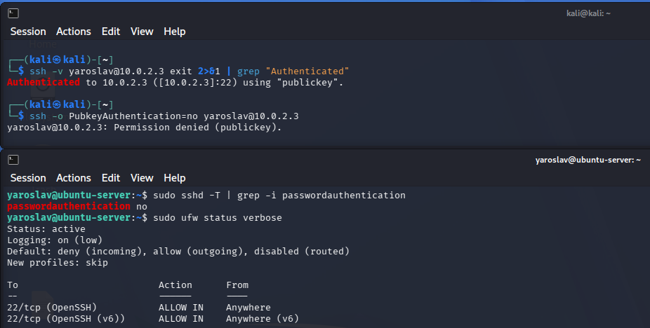

# Linux Security Lab

This is a small project I made while learning Linux and cybersecurity.

I practiced some basic Linux security tasks and also made a few Bash scripts.

## My scripts

### ssh-check.sh

This script checks the SSH log for invalid login attempts.

If the same IP appears more than 2 times, it shows a warning.

### How to run

```bash
chmod +x ssh-check.sh
sudo ./ssh-check.sh
```

### Example

```text
Checking for invalid SSH login attempts...
10.0.2.4 attempted 3 time(s)
 -> WARNING: 10.0.2.4 exceeds the threshold of 2 attempts!
```

---

### backup-ssh-config.sh

This script makes a backup of the SSH configuration files from:

```text
/etc/ssh/
```

It saves the backup in a `backups` folder in my home directory.

The file name also contains the date and time.

### How to run

```bash
chmod +x backup-ssh-config.sh
./backup-ssh-config.sh
```

### Example

```text
Backup saved to /home/user/backups/ssh-backup-2026-10-06_21-15-30.tar.gz
```

---

### disk-check.sh

This script checks how much space is being used on the main disk.

I set the limit to 80%.

If the disk is more than 80% full, it shows a warning.

### How to run

```bash
chmod +x disk-check.sh
./disk-check.sh
```

### Example

```text
Checking disk usage ...
Disk usage is not greater than 80%
```

or

```text
Checking disk usage ...
WARNING! Disk usage is more than 80%
```

---

# Basic hardening

I also made some basic changes to make my Ubuntu server a little safer.

## 1. SSH key login

I set up SSH so I can log in using an SSH key.

**Why:** SSH keys are safer than using only a password because the private key is needed to log in.

I tested it from my Kali machine:

```bash
ssh -v yaroslav@10.0.2.3 exit 2>&1 | grep "Authenticated"
```

The result was:

```text
Authenticated to 10.0.2.3 ([10.0.2.3]:22) using "publickey".
```

This shows I logged in with my SSH key instead of a password.

---

## 2. Password login disabled

I also disabled password login for SSH.

**Why:** If password login is disabled, attackers cannot try to guess the SSH password.

I tested it from Kali with:

```bash
ssh -o PubkeyAuthentication=no yaroslav@10.0.2.3
```

The result was:

```text
Permission denied (publickey).
```

I also checked the SSH server settings on Ubuntu:

```bash
sudo sshd -T | grep -i passwordauthentication
```

The result was:

```text
passwordauthentication no
```

This shows that password authentication is disabled.

---

## 3. Firewall

I also enabled a firewall on the Ubuntu server.

**Why:** The firewall can block unwanted incoming connections while allowing the connections I need.

I checked it with:

```bash
sudo ufw status verbose
```

The result was:

```text
Status: active
Logging: on (low)
Default: deny (incoming), allow (outgoing), disabled (routed)
New profiles: skip

To                         Action      From
--                         ------      ----
22/tcp (OpenSSH)           ALLOW IN    Anywhere
22/tcp (OpenSSH (v6))      ALLOW IN    Anywhere (v6)
```

This shows that the firewall is active.

Incoming connections are denied by default, and SSH is allowed so I can connect to the server.



---

## 4. Login banner

I also made a simple login banner for my lab.

This banner is on my **Windows Server**, not the Ubuntu server. I set it using Group Policy.

It says:

> Security Notice  
> Authorized access only - lab environment


This is just a lab banner to show that the system is for authorized users.

---

# Known limitations

This is still a beginner project.

The SSH backup contains files from `/etc/ssh/`, including private host keys, so the backup file should never be uploaded to GitHub.

I also know that these scripts are simple and can be improved later.

---

# What I learned

While making this project I practiced:

- basic Bash scripts
- checking Linux logs
- SSH
- SSH keys
- SSH configuration
- basic firewall usage
- disk space checking
- making backups
- basic Linux security

I am using this project to practice and learn more about cybersecurity.
